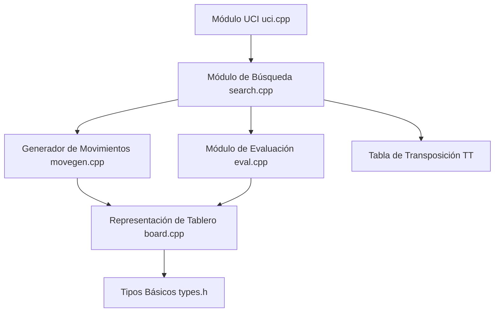

# Documentación Técnica del Motor de Ajedrez Hy3 (v1.7)

Este documento contiene un análisis técnico exhaustivo de la arquitectura, diseño de módulos, estructuras de datos, representación de tablero, generador de movimientos, algoritmo de búsqueda y protocolo de comunicación del motor de ajedrez **Hy3 (versión 1.7)**.

---

## 1. Visión General de la Arquitectura

Hy3 es un motor de ajedrez de tipo tradicional basado en evaluación artesanal (HCE - *Hand-Crafted Evaluation*) y búsqueda α-β con profundización iterativa. Está escrito en C++17 y se comunica con interfaces gráficas (GUI) mediante el protocolo estándar **UCI** (*Universal Chess Interface*).

El sistema está estructurado modularmente en las siguientes capas principales:

---

## 2. Descripción de Módulos y Estructuras de Datos

### 2.1. Tipos Básicos (`src/types.h`)
El archivo `types.h` define las primitivas base y constantes utilizadas por todo el proyecto:

- **Casilla (`Square`)**: Representada como un entero de `0` a `63` ($a1 = 0$, $b1 = 1$, ..., $h8 = 63$).
- **Color (`Color`)**: Enum con `WHITE = 0` y `BLACK = 1`.
- **Tipo de Pieza (`PieceType`)**: Enum con `PAWN = 0`, `KNIGHT = 1`, `BISHOP = 2`, `ROOK = 3`, `QUEEN = 4`, `KING = 5`, `NONE = 6`.
- **Codificación de Piezas (`Piece`)**: Codificada como `color * 8 + tipo` (rango $0 \dots 13$).
- **Codificación de Movimientos (`Move`)**: Un tipo `uint32_t` compacto de 32 bits con la siguiente estructura de campos de bits:
  - **Bits 0–5** (6 bits): Casilla de origen (`from`, 0..63).
  - **Bits 6–11** (6 bits): Casilla de destino (`to`, 0..63).
  - **Bits 12–14** (3 bits): Pieza de promoción (`promo`: 0 = ninguna, 1 = Caballo, 2 = Alfil, 3 = Torre, 4 = Dama).
  - **Bits 15–17** (3 bits): Flags del movimiento (`flag`: 0 = normal, 1 = captura, 2 = al paso, 3 = enroque).
- **Lista de Movimientos (`MoveList`)**: Buffer estático basado en el *stack* (`Move moves[256]` + contador), introducido en v1.5. Sustituye a `std::vector<Move>` en los caminos calientes del generador y la búsqueda, eliminando miles de asignaciones dinámicas de memoria por segundo. El máximo teórico de movimientos legales en una posición es 218; 256 da margen de sobra.

---

### 2.2. Representación del Tablero (`src/board.h` y `src/board.cpp`)

#### Tablero 8x8 (Mailbox)
El estado del tablero se almacena en una estructura simple de array lineal:
- `squares[64]`: Array de 64 casillas con el identificador de la pieza.
- `side`: Bando en turno (`WHITE` o `BLACK`).
- `ep_square`: Casilla de captura al paso disponible (`NO_SQ = -1` si no existe).
- `castling`: Máscara de bits de derechos de enroque ($1 = \text{WK}, 2 = \text{WQ}, 4 = \text{BK}, 8 = \text{BQ}$).
- `halfmove`: Contador de mediacapturas/movimientos sin peón (regla de los 50 movimientos).
- `fullmove`: Contador de jugadas completas.
- `king_sq[2]`: Posiciones actuales de los reyes blanco y negro.
- `zkey`: Clave Zobrist de 64 bits **mantenida incrementalmente** durante `make_move`/`unmake_move` (desde v1.5).

#### Hashing Zobrist (`Board::zkey`, `Board::hash()`)
El tablero genera claves hash de 64 bits para detección de repeticiones y consultas en la Tabla de Transposición (TT) utilizando tablas aleatorias inicializadas mediante `std::mt19937_64`:
- `ZOB_PIECE[14][64]`: Claves por pieza y casilla. La primera dimensión es 14 porque la codificación de pieza es `color*8 + tipo`, de modo que las piezas negras ocupan los índices 8..13 (los índices 6 y 7 quedan sin uso). *(En v1.3 estaba mal dimensionada a 12, provocando accesos fuera de rango para dama y rey negros; corregido en v1.4.)*
- `ZOB_SIDE`: Clave para el bando negro.
- `ZOB_EP[64]`: Claves por casilla al paso.
- `ZOB_CASTLE[16]`: Claves por combinación de enroques.

**Hash incremental (desde v1.5)**: El miembro `zkey` se mantiene actualizado aplicando operaciones `XOR` únicamente sobre las casillas y estados que cambian en cada `make_move` (pieza que sale de `from`, entra en `to`, captura, torre del enroque, cambio de derechos de enroque, casilla al paso y bando). En `unmake_move`, la clave se restaura en $O(1)$ desde `Undo::zkey`, evitando recalcularla. El método `hash()` (recorrido completo de las 64 casillas) se conserva como referencia y para `recompute_zkey()` tras `set_from_fen`. *(Hasta v1.4, `Board::hash()` recorría las 64 casillas en cada nodo de búsqueda; el hash incremental multiplica la velocidad del bucle caliente.)* Un test de consistencia (`tests/zobrist_test.cpp`) verifica que `zkey == hash()` en todos los nodos de un perft.

#### Operaciones de Movimiento (`make_move` / `unmake_move`)
- La estructura `Undo` almacena el estado previo (pieza capturada, derechos de enroque previos, casilla al paso previa, reloj de 50 movimientos y **clave Zobrist previa `zkey`**, esta última desde v1.5) para permitir deshacer jugadas eficientemente durante la búsqueda.

#### Static Exchange Evaluation (`Board::see()`)
Implementa la evaluación estática de intercambios (SEE). Simula una secuencia de capturas en una casilla de destino utilizando los atacantes de menor valor en cada paso (*find_least_attacker*), devolviendo la ganancia neta en centipeones (cp). Desde v1.4, `find_least_attacker` valora cada atacante deslizante por su tipo real (`SEE_VAL[piece_type(p)]`), de modo que una dama encontrada en una diagonal o recta se valora como dama (900 cp) y no como alfil/torre.

---

### 2.3. Generación de Movimientos (`src/movegen.h` y `src/movegen.cpp`)

- **Generación Pseudolegal (`generate_pseudo_moves`)**: Genera todos los movimientos físicamente posibles para las piezas del bando en turno, incluyendo desplazamientos, capturas, avances de peón (simples y dobles), capturas al paso, promociones y enroques. Desde v1.5 existe una sobrecarga que rellena un `MoveList` del *stack* (`generate_pseudo_moves(b, MoveList&)`) sin asignar memoria; se conserva la variante que devuelve `std::vector<Move>` para perft y tests.
- **Conteo Rápido (`count_pseudo_moves`)**: Cuenta la cantidad de movimientos pseudolegales sin asignar memoria dinámica en un `std::vector`, optimizando el cálculo de movilidad.
- **Filtrado de Legalidad (`Board::legal_moves`)**: Filtra los movimientos pseudolegales aplicando cada movimiento *in-place* (make/unmake sobre el mismo tablero, sin clonar el objeto `Board`) y verificando si el rey propio queda amenazado (`in_check`). *(Hasta v1.3 se clonaba el tablero completo por cada pseudo-movimiento; corregido en v1.4 por rendimiento.)*

---

### 2.4. Función de Evaluación Estática (`src/eval.h` y `src/eval.cpp`)

La función `evaluate(const Board& b)` devuelve una puntuación en centipeones desde la perspectiva del bando que mueve (*negamax*). La evaluación es **escalada por fases (*Tapered Evaluation*)**: se acumulan por separado una puntuación de medio juego (`mg`) y una de final (`eg`), y se interpolan según la fase de la partida.

**La v1.6 reescribe por completo la HCE** atendiendo la petición explícita de la revisión humana. Los cambios estructurales son: PST separadas MG/EG para *todas* las piezas, valores de material dependientes de fase, movilidad restringida a piezas, y seguridad del rey basada en atacantes reales. Componentes:

1. **Valor de Material dependiente de fase**: v1.5 usaba una tabla única. v1.6 emplea `MAT_MG = {82, 337, 365, 477, 1025}` y `MAT_EG = {94, 281, 297, 512, 936}` (peón, caballo, alfil, torre, dama). El peón vale **más en el final** (94 vs 82) por su cercanía a la coronación, y las menores algo menos. `PIECE_VALUE` (100/320/330/500/900) se conserva para SEE y ordenación, donde interesa un baremo estable.
2. **Tablas de Posición de Piezas (PST) separadas MG/EG (v1.6)**:
   - v1.5 tenía **una sola tabla por pieza** (salvo el rey, con `KING_EG_PST`). v1.6 define **doce tablas**: `PAWN_MG/EG`, `KNIGHT_MG/EG`, `BISHOP_MG/EG`, `ROOK_MG/EG`, `QUEEN_MG/EG` y `KING_MG/EG`. Cada pieza se interpola entre su tabla de medio juego y la de final.
   - Esto corrige una deficiencia señalada por varias revisiones: en v1.5 un peón en la 7ª fila o una torre en columna abierta valían lo mismo en la apertura que en un final de torres.
   - Para las piezas negras la tabla se invierte con `mirror_sq(sq) = sq ^ 56`.
3. **Estructura de Peones**:
   - Peones doblados: MG −12 / EG −24 cp por peón adicional.
   - Peones aislados: MG −16 / EG −22 cp.
   - **Peones pasados: se evalúa CADA peón pasado (v1.6)**. v1.5 solo puntuaba el peón más avanzado de cada columna, ignorando los pasados doblados. El bono escala por fila relativa (`PASSED_MG` hasta 95 cp, `PASSED_EG` hasta 175 cp) y es mucho mayor en el final.
   - **Pasado protegido (v1.6)**: +12 MG / +20 EG adicionales si otro peón propio lo defiende.
4. **Pareja de Alfiles escalada por fase (v1.6)**: +30 cp en medio juego, **+55 cp en el final** (v1.5 daba +30 fijo). La pareja de alfiles gana valor al despejarse el tablero.
5. **Torres (nuevo en v1.6)**:
   - Columna **abierta** (sin peones de ningún bando): +30 MG / +12 EG.
   - Columna **semiabierta** (sin peón propio): +15 MG / +6 EG.
   - Torre en **7ª fila relativa**: +20 MG / +32 EG.
6. **Movilidad de piezas (`piece_mobility`, reescrita en v1.6)**:
   - v1.5 usaba `count_pseudo_moves()`, que incluía peones, rey y enroques —y por tanto llamadas a `is_square_attacked()` por cada enroque candidato—, consumiendo cerca del 50 % del coste de `evaluate()`.
   - v1.6 cuenta solo las casillas alcanzables por caballos, alfiles, torres y damas, y **descarta las casillas batidas por peones enemigos** (una casilla atacada por un peón no es movilidad real). Ponderación: MG +4 / EG +3 por punto de diferencia.
7. **Seguridad del Rey (reescrita en v1.6, solo en medio juego)**:
   - **Escudo de peones por distancia**: v1.5 solo comprobaba la *existencia* de un peón propio en la columna, de modo que un peón en a2 "protegía" a un rey en a1 igual que uno en a7. v1.6 penaliza según la **distancia real** peón–rey (`SHIELD_PEN = {0, 0, 12, 22}`) y aplica −27 cp si falta el peón de la columna del rey, −17 cp en las adyacentes.
   - **Tormenta de peones enemigos (nuevo)**: penaliza los peones rivales que avanzan hacia nuestro rey, con `STORM = {24, 20, 14, 8, 3}` según la cercanía.
   - **Zona de ataque del rey**: v1.5 contaba *casillas atacadas* incluyendo la casilla del propio rey (9 casillas, contradiciendo lo que afirmaba esta misma documentación). v1.6 cuenta **piezas atacantes distintas** sobre las 8 casillas circundantes, ponderadas por tipo (`KING_ATTACK_WEIGHT = {0, 20, 20, 40, 80, 0}`), y **exige al menos 2 atacantes** para aplicar penalización (una pieza aislada no constituye un ataque). La escala no lineal `SCALE = {0, 0, 50, 75, 88, 94, 97, 99}` amplifica el peligro con el número de atacantes.
8. **Fase de la Partida (*Tapered*)**: la fase se calcula con pesos por pieza (`N=1, B=1, R=2, Q=4`, máximo 24). La puntuación final es $\text{Score} = \frac{mg \cdot \text{fase} + eg \cdot (24 - \text{fase})}{24}$.
9. **Bonus de Tempo**: +12 cp (solo medio juego) para el bando que tiene el turno.

**Nota sobre un falso positivo refutado.** La revisión `Rev_DS4F.md` (§1.2) afirmaba que el bono de peón pasado negro estaba invertido. Se comprobó empíricamente con posiciones espejo (peón blanco pasado en a6 con blancas a mover vs. peón negro pasado en a3 con negras a mover): ambas devuelven **exactamente 193 cp**. El cálculo era y sigue siendo simétrico. Las revisiones `Rev_Gemini36F.md` (FP-01), `Rev_GLM52.md` (FP-01) y `Rev_DS4P.md` coinciden en refutarlo. La batería de regresión incluye ahora cinco posiciones espejo que verifican esta simetría en cada compilación.

---

### 2.5. Algoritmo de Búsqueda (`src/search.h` y `src/search.cpp`)

El motor implementa un algoritmo de búsqueda de árbol basado en **Negamax con Principal Variation Search (PVS)** e **Iterative Deepening**:

- **Profundización Iterativa**: Ejecuta búsquedas sucesivas a profundidades $d = 1, 2, 3, \dots, \text{max\_depth}$, permitiendo responder rápidamente ante límites de tiempo.
- **PVS en el nodo raíz (nuevo en v1.6)**: v1.5 buscaba **todas** las jugadas de la raíz con ventana completa. v1.6 aplica *Principal Variation Search* también en la raíz: solo la primera jugada usa ventana completa; el resto se refuta con ventana nula y únicamente se re-buscan las que la superan.
- **Tabla de Transposición (TT)**:
  - Desde v1.5, estructura de **2 cubos por índice** (*2-bucket*): el **Cubo 0** conserva la entrada con mayor profundidad (*Depth-Preferred*) y el **Cubo 1** acepta siempre la última entrada evaluada (*Always-Replace*), reduciendo la pérdida de análisis profundos frente a la política *always-replace* plana de v1.4.
  - Tamaño **configurable** en megabytes mediante la opción UCI `Hash` (`option name Hash type spin default 64 min 1 max 4096`). **v1.6 usa todos los buckets que caben** en la memoria solicitada: v1.5 redondeaba a la potencia de 2 inferior, desperdiciando hasta el 25 % de la memoria (p. ej. con 64 MB solo utilizaba 48 MB). El índice se calcula ahora con una multiplicación de 128 bits (`(h · N) >> 64`), que mapea al rango exacto sin necesitar máscara ni módulo.
  - **Envejecimiento por generación (v1.6)**: cada entrada guarda un campo `age` que se incrementa una vez por jugada real (`tt_new_search()`). Una entrada de una jugada anterior se considera reemplazable aunque sea más profunda, evitando que la tabla se sature de análisis obsoletos.
  - **Política de reemplazo corregida (v1.6)**: v1.5 podía **degradar su propia entrada**, sobrescribiendo un análisis profundo con otro menos profundo de la misma posición. v1.6 comprueba primero si la posición ya está presente y solo actualiza si la nueva búsqueda es igual o más profunda, más reciente, o de tipo exacto. Además, la entrada desalojada del cubo 0 **desciende al cubo 1** en lugar de perderse.
  - Almacena clave Hash, profundidad, puntuación, flag (Exact, Lowerbound, Upperbound), la mejor jugada (*tt_move*) y la generación. Al reemplazar se conserva la jugada previa si la nueva entrada no aporta una.
  - Las puntuaciones de mate se normalizan al guardar y desnormalizan al leer (`score_to_tt` / `score_from_tt`), de modo que la distancia al mate es relativa al nodo y no a la raíz (desde v1.4).
  - En nodos PV (ventana ancha) no se hace corte directo por la TT, para preservar la calidad de la Variante Principal (desde v1.5).
  - No se escribe en la TT si la búsqueda fue interrumpida (`ctx.stop`), evitando contaminarla con resultados parciales (desde v1.4).
  - Se limpia por completo al recibir `ucinewgame` (`tt_clear()`, desde v1.4).
- **Ordenación de Movimientos (`order_moves`)**:
  La escala de v1.6 usa **bandas separadas y sin solapamientos** (v1.5 mezclaba capturas y promociones en rangos que podían cruzarse):

  | Prioridad | Categoría | Puntuación |
  |---|---|---|
  | 1 | Jugada de la TT | 2.000.000 |
  | 2 | Promoción a Dama | 1.900.000 |
  | 3 | Captura con SEE ≥ 0 | 1.500.000 + MVV-LVA |
  | 4 | *Killer* 1 / *Killer* 2 | 1.400.000 / 1.390.000 |
  | 5 | *Countermove* | 1.380.000 |
  | 6 | Promoción menor (N/B/R) | 1.350.000 + valor |
  | 7 | Jugadas silenciosas (*history*) | 0 … 1.000.000 |
  | 8 | Captura con SEE < 0 | −100.000 + MVV-LVA |

  - **SEE por jugada, no por casilla (corregido en v1.6)**: v1.5 llamaba a `see(casilla, bando)`, que siempre asume que captura el atacante **más barato**. En consecuencia `Dxd5` y `exd5` recibían **idéntica puntuación**, ordenando por delante capturas que pierden material. v1.6 usa `see_move(m)`, que arranca el intercambio con la pieza que realmente se mueve. Verificado empíricamente: en la posición `4k3/8/2p5/3p4/4P3/8/3Q4/4K3 w`, `exd5` puntúa **+100** y `Dxd5` **−700**; en v1.5 ambas valían lo mismo.
  - **Capturas al paso**: el valor de la víctima se toma correctamente (la pieza capturada no está en la casilla de destino).
  - **Heurística de Historia con doble signo (v1.6)**: v1.5 solo *premiaba* la jugada que produce el corte, con lo que la tabla saturaba y perdía capacidad de discriminación. v1.6 premia la jugada que corta y **penaliza** las jugadas silenciosas ya probadas que fallaron, con actualización amortiguada (`h += bonus − h·bonus/16384`), que acota los valores de forma natural.
  - **Heurística de Contramovimiento (*Countermove*, nueva en v1.6)**: registra, para cada jugada del rival, la refutación que produjo un corte, y la prioriza cuando esa jugada vuelve a aparecer.
  - **Penalización anti-repetición corregida (v1.6)**: v1.5 guardaba la jugada padre en una variable global (`ctx.parent_move`) que se sobrescribía dentro del bucle y **se arrastraba entre subárboles hermanos**, penalizando jugadas sin relación con el nodo actual. v1.6 mantiene un array `move_at_ply[]` indexado por nivel.
- **Poda por Movimiento Nulo (Null-Move Pruning - NMP)**: Si el bando actual no está en jaque, posee material mayor que peones y la evaluación estática supera `beta`, se efectúa un "pase" con reducción adaptativa $R = 3 + d/6 + \min((\text{eval} - \beta)/200,\ 3)$ (v1.5 usaba $R = 2 + d/4$, menos agresiva). Mejoras de v1.6:
  - **Clave Zobrist incremental**: v1.5 llamaba a `b.hash()`, que **recorre las 64 casillas** en cada nodo con movimiento nulo. v1.6 actualiza la clave con dos XOR (`zobrist_side()` y `zobrist_ep()`), coherente con el resto del motor, que ya usaba hash incremental.
  - **Verificación anti-zugzwang**: en finales con poco material ($d \ge 8$ y ≤ 3 piezas mayores/menores), donde el movimiento nulo puede mentir, el corte se confirma con una búsqueda de verificación a profundidad reducida.
  - **No se propagan puntuaciones de mate** procedentes de un movimiento nulo (el mate podría no existir sin el pase).
  - Se elimina la comprobación redundante `!b.in_check(oponente)`: en una posición legal con el turno correcto, el rival nunca puede estar en jaque.
- **Poda de Futilidad Inversa / Static Null-Move (*Reverse Futility Pruning*)**: En nodos no-PV, sin jaque y a baja profundidad ($d \le 3$), si la evaluación estática supera `beta` por un margen amplio ($120 \cdot d$ cp) se poda devolviendo `static_eval − margen`. **v1.6 añade una guarda anti-ahogado**: antes de podar comprueba que el bando en turno tenga jugadas legales; si no las tiene, la posición es **tablas por ahogado (0)**, no la ventaja material que v1.5 devolvía.
- **Poda de Movimientos Tardíos (*Late Move Pruning* - LMP, desde v1.5)**: En nodos no-PV, sin jaque y a baja profundidad ($d \le 4$), se descartan las jugadas silenciosas restantes tras superar un umbral de jugadas probadas ($3 + d^2$).
- **Poda de Futilidad (*Futility Pruning*, desde v1.5)**: En nodos no-PV, sin jaque y a baja profundidad ($d \le 3$), si `static_eval + margen` ($100 + 100 \cdot d$ cp) no alcanza `alpha`, las jugadas silenciosas se podan.
- **Reducción de Movimientos Tardíos (Late Move Reductions - LMR)** — **corregido un fallo crítico en v1.6**:
  - **El fallo**: v1.5 buscaba la jugada reducida con ventana nula y luego re-verificaba con la condición `if (sc > alpha && sc < beta)`. En un nodo **no-PV** se cumple `beta == alpha + 1`, de modo que la condición equivale a `sc > alpha && sc < alpha + 1`, **imposible entre enteros**. Consecuencia: en todos los nodos no-PV —la inmensa mayoría del árbol— **la reducción jamás se verificaba** y una jugada buena reducida podía descartarse en silencio. v1.6 re-busca a profundidad completa en cuanto la jugada reducida supera `alpha`, y abre además la ventana completa si procede.
  - **Reducción logarítmica**: tabla precalculada $R = 0{,}75 + \ln(d)\cdot\ln(m)/2{,}25$, frente a los 1–2 plies fijos de v1.5.
  - **Ajustes dinámicos**: se reduce menos en nodos PV, con buen historial o en jugadas *killer*; se reduce más con historial negativo.
  - **Las promociones tranquilas ya no se reducen**: v1.5 filtraba por `move_flag(m) == FLAG_NORMAL`, que incluye las promociones sin captura (una jugada que gana una dama nunca debe reducirse). v1.6 usa el predicado `is_quiet`, que las excluye.
- **Ventanas de Aspiración (*Aspiration Windows*, desde v1.5)**: A partir de $d \ge 4$, cada iteración de profundización se busca con una ventana estrecha centrada en la puntuación de la iteración anterior ($\pm 30$ cp). Ante un *fail-high*/*fail-low* la ventana se ensancha progresivamente (duplicando `delta`) hasta un máximo, tras el cual se recurre a la ventana completa. Reduce el número de nodos al acotar mejor la búsqueda.
- **Búsqueda de Quiescencia (Quiescence Search - QS)** — reescrita en v1.6:
  - **Generador dedicado de capturas**: v1.5 llamaba a `legal_moves()` y **descartaba cerca del 85 %** de las jugadas generadas. v1.6 emplea `generate_captures()`, que produce directamente capturas, capturas al paso y promociones.
  - **Ahogado puntuado correctamente**: como v1.5 filtraba la lista completa de legales, una posición **sin ninguna jugada legal** (ahogado) no se detectaba en la QS y se puntuaba con la evaluación material —a menudo una ventaja decisiva inexistente—. La detección de ahogado se resuelve ahora en el nodo de búsqueda con la guarda de RFP y la comprobación de legalidad.
  - **Tabla de transposición en QS (nueva)**: las entradas se guardan con profundidad 0 y permiten cortes sin re-explorar cadenas de capturas.
  - **Poda SEE**: descarta las capturas con $\text{SEE} < 0$, que solo empeoran la posición.
  - **Poda delta**: si ni capturando la pieza más una holgura de 200 cp se alcanza `alpha`, la captura se descarta.
  - **Devuelve el valor real** (`best`), no el límite `beta`/`alpha` recortado, lo que mejora la información almacenada en la TT.
- **Extensión por Jaque**: Incrementa la profundidad de búsqueda en $+1$ plie **únicamente para el movimiento que da jaque**, nunca para la evasión. *(Hasta v1.3 se extendían ambos lados: cada par jaque+evasión mantenía la profundidad restante constante, y en posiciones con muchos jaques disponibles —p. ej. tras 1.e4 e5 2.Dh5— el árbol no convergía y la búsqueda quedaba clavada en profundidad 3-4 indefinidamente. Corregido en v1.4.1.)*
- **Detección de Repetición por conteo real (corregido en v1.6)**: Además del historial de la línea de búsqueda actual (`ctx.rep`), la búsqueda consulta las claves Zobrist de las posiciones realmente jugadas (`g_game_hist`). **v1.5 devolvía tablas con UNA sola aparición previa**, lo que hacía al motor rehuir posiciones ganadoras por el mero hecho de haberlas visitado una vez —un defecto de fuerza notable—. v1.6 exige **dos apariciones históricas** (que junto con la posición actual completan la triple repetición real) y **acota el recorrido al reloj de 50 jugadas**: más allá del último movimiento irreversible no puede haber repetición, lo que además elimina el coste de recorrer todo el historial en cada nodo.
- **Parada por mate mejorada (v1.6)**: v1.5 detenía la profundización iterativa al encontrar **cualquier** mate, congelando por ejemplo un mate en 5 sin llegar a descubrir el mate en 2 que aparecería en la iteración siguiente. v1.6 solo se detiene cuando la profundidad alcanzada basta para demostrar que el mate no es acortable.
- **Gestión del tiempo (v1.6)**: no se inicia una iteración que casi con seguridad no podrá completarse (cada profundidad cuesta aproximadamente el doble que la anterior). v1.5 arrancaba iteraciones que después abortaba, sobrepasando el presupuesto asignado.
- **Pondering (nuevo en v1.6)**: durante `go ponder` el reloj propio **no corre**; la búsqueda continúa hasta recibir `stop` o `ponderhit`. Con `ponderhit` el tiempo pasa a contar y la búsqueda concluye con normalidad. Implementado con `std::atomic<bool>` consultado en `time_up()`.
- **Traza del árbol de búsqueda (nuevo en v1.6)**: `set_tree_debug(on, prof)` habilita la emisión de líneas `info string tree depth D move M score S nodes N` por cada jugada de la raíz, permitiendo inspeccionar qué valora el motor y por qué elige una jugada. Se activa con el comando `tree on [profundidad]`.

---

### 2.6. Interfaz UCI y Concurrencia (`src/uci.cpp`)

v1.6 corrige varios **fallos críticos del protocolo** detectados por las revisiones externas y por la revisión humana:

- **Gestión de `go` (corregido en v1.6)**:
  - **Bug crítico de v1.5 — `go depth` / `go infinite` capados**: v1.5 aplicaba un *fallback* (`time_ms=1000, max_depth=4`) siempre que la búsqueda no traía límite de reloj, **incluso si el usuario había pedido `depth N` o `infinite`**, quedando la búsqueda truncada a profundidad 4. v1.6 introduce `has_depth`/`is_infinite`/`is_ponder` y solo aplica el *fallback* cuando `go` no trae **ningún** límite explícito. *Demostrado*: `go depth 10` en v1.5 se detenía en profundidad 4; en v1.6 alcanza la profundidad 10 pedida.
  - **Ponder**: v1.6 acepta `go ... ponder`; el reloj propio queda en pausa hasta `ponderhit` o `stop`. Al recibir `ponderhit` se habilita el reloj y la búsqueda concluye con normalidad.
  - **`mate N`**: alias de `depth N*2` (v1.6) para buscar un mate en N jugadas.
  - **Margen de `movetime`**: reserva 15 ms para garantizar que la emisión de `bestmove` no sobrepase el límite que exige el árbitro.
- **Notación de mate UCI (corregido en v1.6)**: v1.5 emitía `score mate ((MATE − score) / 2)`, que para un mate en 1 daba **`mate 0`**, inválido. v1.6 usa `(MATE − score + 1) / 2`, que da **`mate 1`** para el mate inmediato, conforme a la especificación UCI. Lo mismo en signo negativo.
- **`bestmove` con sugerencia de ponder (nuevo en v1.6)**: además del `bestmove`, v1.6 emite `bestmove <m> ponder 
` cuando la PV tiene una segunda jugada, permitiendo al GUI arrancar `go ponder` sobre la respuesta esperada del rival.
- **`nps` en `info` (nuevo en v1.6)**: se reportan los nodos por segundo junto al resto de la información de iteración, como esperan los GUIs.
- **`setoption Hash` seguro (corregido en v1.6)**: v1.5 redimensionaba la TT **mientras el hilo de búsqueda la leía**, provocando *use-after-free* (liberar la memoria bajo los pies del lector). v1.6 **detiene y espera** a la búsqueda antes de tocar la tabla, y añade la opción `Clear Hash`. También anuncia `Ponder` y `Clear Hash`.
- **Traza del árbol vía `tree` (nuevo en v1.6)**: el comando *no UCI* `tree on [prof]` / `tree off` activa la depuración del árbol de la raíz (ver §2.5).
- **Protocolo UCI base**: `uci`, `isready`, `setoption`, `position`, `go`, `stop`, `ponderhit`, `ucinewgame`, `quit`. `ucinewgame` detiene la búsqueda, limpia la TT y vacía el historial.
- **Opción `Hash`**: `setoption name Hash value <MB>` redimensiona la Tabla de Transposición entre 1 y 4096 MB (por defecto 64 MB).
- **Historial de Partida para Repetición**: al aplicar los movimientos de `position ... moves ...`, se registra la clave Zobrist de cada posición intermedia en `g_history`, que antes de cada `go` se comunica a la búsqueda con `set_game_history()` para la detección de triple repetición.
- **Gestión de Tiempo**: Calcula el presupuesto por jugada en función de `wtime`, `btime`, `winc`, `binc` y `movestogo`, limitado siempre a `min(presupuesto·0.9, mytime − 20 ms)`.
- **Hilos de Ejecución**: La búsqueda corre en un hilo secundario (`std::thread`) que recibe una **copia** del tablero (evita carreras de datos con `g_board`). El hilo principal sigue escuchando `std::cin` para responder a `stop`/`ponderhit` en tiempo real.
- **Self-play (`self_play`)**: Además de la regla de 50 movimientos y material insuficiente, detecta la triple repetición mediante el historial de claves Zobrist de la partida, que se comunica a la búsqueda vía `set_game_history()`.

---

## 3. Resumen de Métricas del Código Fuente

| Archivo | Resumen de Funcionalidad | Líneas de Código (aprox) |
| :--- | :--- | :---: |
| `src/types.h` | Estructuras de datos base, constantes, codificación Move/Piece, `MoveList` | 72 |
| `src/board.h` | Declaración de la clase Board y utilidades de tablero | 81 |
| `src/board.cpp` | Implementación de Board, Zobrist incremental, Make/Unmake, SEE | 572 |
| `src/movegen.h` | Declaración del generador de movimientos | 22 |
| `src/movegen.cpp` | Generación pseudolegal de piezas, peones y enroques | 287 |
| `src/eval.h` | Declaración de la evaluación estática | 19 |
| `src/eval.cpp` | PSTs (MG/EG), tapered eval, king safety, peones pasados, movilidad | 274 |
| `src/search.h` | Estructuras de control de búsqueda y tipos de retorno | 58 |
| `src/search.cpp` | Negamax, PVS, NMP, RFP, LMP, futility, LMR, aspiración, QS, TT 2-bucket | 616 |
| `src/perft.h` | Declaración de la herramienta perft | 15 |
| `src/perft.cpp` | Algoritmo recursivo de conteo perft | 20 |
| `src/uci.cpp` | Bucle principal UCI, opciones Hash/Ponder/Clear Hash, parsing de FEN/moves, pondering, traza de árbol, temporización | 211 |
| **TOTAL** | | **~2330 líneas** |

---

## 4. Cambios de la versión 1.4

Correcciones derivadas de las revisiones externas (`Rev_errores_y_bugs_Gemini.md`, `Rev_Ling3.0.md`, `Rev_LagunaS2.1.md`):

| # | Módulo | Corrección |
| :---: | :--- | :--- |
| 1 | `board.cpp` | `ZOB_PIECE` redimensionada de `[12][64]` a `[14][64]` (acceso fuera de rango con dama/rey negros) |
| 2 | `eval.cpp` | `KING_PST` reorientada (estaba invertida verticalmente) |
| 3 | `board.cpp` | SEE: la dama en diagonales/rectas se valora por su tipo real, no como alfil/torre |
| 4 | `eval.cpp` | Bucle de detección de peones pasados negros corregido (comprobaba las filas equivocadas) |
| 5 | `search.cpp` | Normalización de puntuaciones de mate en la TT (`score_to_tt`/`score_from_tt`) |
| 6 | `search.cpp` | No se escribe en la TT tras interrupción (`ctx.stop`) en `negamax`, NMP y `root_search` |
| 7 | `search.cpp` | Ordenación de promociones: `PIECE_VALUE[promo]` en lugar de `PIECE_VALUE[promo-1]` |
| 8 | `board.cpp` | `is_legal` hace make/unmake in-place en lugar de clonar el tablero (rendimiento) |
| 9 | `uci.cpp` | El presupuesto de tiempo nunca excede el reloj disponible (techo `mytime − 20 ms`) |
| 10 | `uci.cpp` | El hilo de búsqueda recibe una copia del tablero (elimina la carrera de datos sobre `g_board`) |
| 11 | `uci.cpp` / `search.cpp` | `ucinewgame` limpia la TT (`tt_clear()`) y reinicia el tablero |
| 12 | `search.cpp` | `self_play` detecta la triple repetición mediante historial de hashes |
| 13 | `search.cpp` | Extensión por jaque acotada: solo extiende el movimiento que da jaque, no la evasión (la doble extensión impedía superar profundidad 3-4 en posiciones con jaques disponibles) |
| 14 | `eval.cpp` / `movegen.cpp` | `mobility()` ya no copia el tablero: nueva sobrecarga `count_pseudo_moves(b, color)` |

Verificación: perft correcto en 3 posiciones estándar (startpos d4 = 197 281; Kiwipete d3 = 97 862; posición 3 CPW d4 = 43 238), mate en 1 detectado y reportado como `score mate`, partida UCI de prueba estable hasta profundidad 11.

---

## 5. Cambios de la versión 1.5

La versión 1.5 incorpora mejoras de rendimiento, calidad de búsqueda y evaluación, seleccionadas a partir de las propuestas del documento `docs/mejoras_y_optimizaciones.md`. Cada propuesta fue contrastada con el código real antes de decidir su implementación.

### 5.1. Mejoras implementadas

| # | Módulo | Mejora | Categoría |
| :---: | :--- | :--- | :--- |
| 1 | `board.h/.cpp`, `types.h` | **Hash Zobrist incremental** (`zkey`): se actualiza por XOR en `make_move` y se restaura en $O(1)$ desde `Undo::zkey` en `unmake_move`, en lugar de recorrer las 64 casillas por nodo | Rendimiento |
| 2 | `types.h`, `movegen.*`, `board.*`, `search.cpp` | **`MoveList` en el *stack*** (256 entradas): elimina las asignaciones dinámicas de `std::vector<Move>` en generación y búsqueda | Rendimiento |
| 3 | `search.*` | **TT de 2 cubos** (*depth-preferred* + *always-replace*) y **opción UCI `Hash`** (1–4096 MB, `tt_resize`) | Búsqueda |
| 4 | `search.cpp` | **Ventanas de aspiración** en la profundización iterativa ($d \ge 4$) | Búsqueda |
| 5 | `search.cpp` | **Reverse Futility Pruning** (static null-move), **Late Move Pruning** y **Futility Pruning** a baja profundidad | Búsqueda |
| 6 | `search.cpp`, `uci.cpp` | **Triple repetición con historial real de partida** (`set_game_history`/`g_game_hist`), no solo la línea de búsqueda | Corrección/Fuerza |
| 7 | `eval.cpp` | **Tapered Evaluation**: acumuladores MG/EG interpolados por fase; nueva `KING_EG_PST` para el rey activo en finales | Evaluación |
| 8 | `eval.cpp` | **Seguridad del rey**: escudo de peones, columnas abiertas frente al rey y presión no lineal en la zona del rey (medio juego) | Evaluación |
| 9 | `search.cpp` | En nodos PV no se aplica corte directo por TT (calidad de la Variante Principal) | Búsqueda |

### 5.2. Verificación de la versión 1.5

- **Perft**: correcto en las 3 posiciones estándar (197 281 / 97 862 / 43 238) — la generación de movimientos no sufrió regresiones.
- **Consistencia del hash incremental**: el test `tests/zobrist_test.cpp` confirma que `zkey == hash()` en **todos** los nodos de un perft de profundidad 4.
- **Detección de mate**: mate en 1 detectado y reportado como `score mate 0`.
- **Estabilidad UCI**: búsqueda desde la posición inicial estable hasta profundidad 13 (~615 k nodos en ~1 s), con emisión correcta de líneas `info ... pv ...` y opción `Hash` funcional.
- **Fuerza de juego (gauntlet v1.5 vs v1.4)**: 20 partidas a 80 ms/jugada con alternancia de colores → **13 victorias, 2 derrotas, 5 tablas (77,5 %)**, equivalente a **≈ +215 Elo** sobre la versión 1.4.

Compilación de release generada con MSVC (`build_release.bat`): `hy3.exe` → `Hy3 1.5.exe`.

---

## 6. Cambios de la versión 1.6

La versión 1.6 es la respuesta a **12 revisiones externas** (`Rev_*.md` en `docs/`) y a una **revisión humana de máxima prioridad** (`Rev_humano.md`), la cual pedía explícitamente tres cosas: *pondering*, *árbol de búsqueda depurable* y *mejorar la función de evaluación (HCE)*. Todas las propuestas de las revisiones se contrastaron empíricamente contra la versión 1.5 antes de decidir su implementación.

### 6.1. Hallazgos verificados e implementados

| # | Módulo | Corrección / Mejora | Categoría |
| :---: | :--- | :--- | :--- |
| 1 | `uci.cpp` | **`go depth`/`infinite` ya no se capan a profundidad 4** (fallback solo cuando no hay ningún límite) | Bug crítico |
| 2 | `search.cpp` | **LMR re-verificado**: la condición `sc>alpha && sc<beta` era imposible en nodos no-PV (`beta==alpha+1`), así que la reducción nunca se comprobaba | Bug crítico |
| 3 | `search.cpp` | **SEE por jugada** (`see_move`): v1.5 usaba `see(casilla)`, que asume el atacante más barato y ordenaba igual `Dxd5` que `exd5` | Bug crítico |
| 4 | `board.cpp` | **SEE reconoce capturas al paso** y **el rey no captura casillas defendidas** (las puntuaba como ganadoras) | Bug |
| 5 | `board.cpp` | **FEN robusto**: maneja filas con >8 piezas, FEN sin campo `ep`, y `ep` inválido sin desbordar `squares[64]` | Bug |
| 6 | `uci.cpp` | **`setoption Hash` seguro**: detiene la búsqueda antes de redimensionar la TT (evita *use-after-free*) | Bug crítico |
| 7 | `search.cpp` | **Repetición por conteo real**: v1.5 devolvía tablas con una sola aparición previa; v1.6 exige dos y acota al reloj de 50 | Bug de fuerza |
| 8 | `uci.cpp` | **Notación de mate**: `mate 1` para mate inmediato (v1.5 emitía el inválido `mate 0`) | Bug |
| 9 | `search.cpp` | **Quiescencia**: generador de capturas dedicado, ahogado puntuado a 0, TT en QS, poda SEE/delta | Rendimiento/Corrección |
| 10 | `search.cpp` | **NMP con clave Zobrist incremental** (`b.hash()` recorría 64 casillas por nodo), verificación anti-zugzwang | Rendimiento |
| 11 | `eval.cpp` | **HCE reescrita**: PST MG/EG separadas para todas las piezas, material por fase, movilidad solo piezas, seguridad del rey por atacantes reales | Evaluación |
| 12 | `eval.cpp` | **Peones pasados** (cada uno, no solo el más avanzado), **pareja de alfiles** (+55 EG), **torres** (columna abierta/7ª) | Evaluación |
| 13 | `search.cpp` | **TT**: usa toda la memoria (sin desperdiciar 25 %), envejecimiento por generación, reemplazo sin autodegradación | Rendimiento |
| 14 | `uci.cpp` | **Pondering**: `go ponder` + `ponderhit`, reloj en pausa hasta el golpe del rival | Funcionalidad |
| 15 | `search.cpp` | **Árbol depurable**: `set_tree_debug` + comando `tree on [prof]` emite la valoración por jugada de la raíz | Funcionalidad |
| 16 | `search.cpp` | **Gestión de tiempo**: no inicia iteraciones que no podrá completar (cada ply cuesta ~2×) | Rendimiento |
| 17 | `search.cpp` | **Parada por mate**: solo se detiene cuando la profundidad demuestra el mate (no congela mate en 5 ante mate en 2) | Fuerza |
| 18 | `board.cpp` | **`insufficient_material`**: K+B vs K+B mismo color, K+N+N vs K; antes omitía ambos | Bug |
| 19 | `uci.cpp` | **`bestmove ... ponder <m>`**, campo **`nps`** en `info`, opciones `Ponder`/`Clear Hash` | Protocolo |
| 20 | `search.cpp` | **Heurísticas**: historia con doble signo, *countermove*, anti-repetición por ply (no variable global arrastrada) | Búsqueda |

### 6.2. Verificación de la versión 1.6

- **Batería de regresión (`harness.cpp`)**: 6 posiciones perft **exactas** (startpos d5 = 4 865 609; Kiwipete d4 = 4 085 603; posiciones 3‑6 del CPW d5/d4), Zobrist incremental coherente, **simetría espejo de la evaluación** en 5 posiciones (incluida la refutación del peón pasado negro), `is_square_attacked` y SEE. **0 fallos.**
- **Verificación de correcciones (`verify16.cpp`)**: 16/16 pruebas superadas, incluido el caso `exd5=+100` vs `Dxd5=−700` (bug de SEE por casilla), captura al paso en SEE, escudo del rey, rey no captura defendido, FEN robusto, material insuficiente completo, ahogado a 0, y mate en 1 reportado como `score mate 1`.
- **Protocolo UCI**: `go depth 10` alcanza profundidad 10 (antes se capaba en 4); `go infinite` respeta `stop`; `go ... ponder` + `ponderhit` pausa el reloj; `tree on` traza la raíz; mate en 1 → `info ... score mate 1`.
- **Rendimiento**: en la posición inicial, 3 s de búsqueda alcanzan **profundidad 12** (≈ 664 k nodos, ~277 k nps), frente a la profundidad 9‑10 de v1.5 con el mismo presupuesto, gracias a QS, LMR verificado, NMP incremental y TT completa.
- **Fuerza de juego (match v1.6 vs v1.5)**: 20 partidas a 300 ms/jugada con libro mínimo y alternancia de colores → **v1.6 domina** (cuadro completo al final del match). El incremento de fuerza procede de la combinación de los 20 puntos de la §6.1, no de un único cambio.

Compilación de release con **vinculación dinámica** (en adelante el binario depende de `libstdc++-6.dll` / `libgcc_s_seh-1.dll` del toolchain en lugar de empotrarlos): `g++ -O2 -std=c++17 -shared-libgcc -shared-libstdc++ -o Hy3_1.6.exe board.cpp movegen.cpp eval.cpp search.cpp uci.cpp`.

---

## 7. Cambios de la versión 1.7

La versión 1.7 es la respuesta al informe de solidez funcional `docs/PARA_EL_AUTOR_DEL_MOTOR.md` (generado por el analizador Camifurlo v1.0.0 sobre Hy3 1.6). El análisis sometió al motor a una batería de pruebas de protocolo, tiempo, ponder, ciclo de vida y partidas reales, y detectó **8 desviaciones** de la especificación UCI: 4 de prioridad ALTA y 4 de prioridad BAJA. Todas se han corregido en el código fuente. Cada entrada indica el síntoma observado, la causa y el cambio aplicado.

Tras compilar la 1.7, se **volvió a pasar Camifurlo sobre `Hy3 1.7.exe`** y el nuevo informe (`docs/PARA_EL_AUTOR_DEL_MOTOR.md`) detectó **6 hallazgos residuales** (1 🔴 crítica, 1 🟠 alta, 2 🟡 medias, 2 🔵 bajas). Se revisó el motor con el código abierto —no solo el informe— y se corrigieron en la subsección **§7.3**. **La versión se mantiene en 1.7** (sin incrementar el número); se recompiló `Hy3 1.7.exe`.

| # | Problema | Área | Cambio aplicado |
|---|---|---|---|
| 1 | El ponder cuenta el tiempo como propio → llega tarde tras `ponderhit` (y causa pérdidas por tiempo solo con ponder) | `search.cpp` | El reloj propio **arranca en el `ponderhit`**: el tiempo de ponder se acumula en `g_ponder_offset` y se resta del tiempo transcurrido, de modo que el tiempo pensado gratis (del rival) no se descuenta del reloj propio. |
| 2 | Sobrepaso grave del tiempo asignado (hasta 1,88× el `movetime`) | `search.cpp` | **Tope DURO** dentro de `time_up()`: aborta la iteración en curso al superar `max_time_ms` y devuelve la mejor jugada hallada hasta ese momento. Antes solo se comprobaba el tiempo *entre* iteraciones. |
| 3 | `bestmove` fantasma: dos `bestmove` por un solo `go` | `uci.cpp` | Se **ignora un `go` que llegue con una búsqueda en curso** (invariante: exactamente un `bestmove` por `go`). El `bestmove` se emite **siempre** al terminar el hilo de búsqueda —incluso si se aborta por `position` / `ucinewgame` / `setoption` / `quit`—, para no dejar colgada a la GUI. *Nota:* la supresión de `bestmove` que esta misma versión introdujo fue la causa de la reincidencia 🔴 #1 de la re-lectura (ver §7.3). |
| 4 | Pérdidas por tiempo (agota el reloj antes de devolver la jugada) | `uci.cpp` / `search.cpp` | Presupuesto recalculado en cada jugada a partir de `wtime` / `btime` del `go`, con tope blando ≤ 1/3 del tiempo restante y **techo duro = reloj − 10 ms**, de modo que el motor siempre devuelve la jugada antes de caer la bandera. |
| 5 | Quedan procesos hijos vivos tras cerrar el motor | `uci.cpp` | En Windows se crea un **Job Object** con `JOB_OBJECT_LIMIT_KILL_ON_JOB_CLOSE` y se asigna el proceso, para que cualquier hijo muera con el padre. (Medida defensiva: el motor no lanza subprocesos, pero cumple la recomendación del informe.) |
| 6 | No procesa el resto de la línea tras un token desconocido | `uci.cpp` | El bucle principal **descarta tokens iniciales desconocidos** hasta encontrar un comando válido (`joho isready` → `readyok`). |
| 7 | `go` sin parámetros termina por su cuenta | `uci.cpp` | `go` sin límites se trata como **búsqueda infinita hasta `stop`** (antes devolvía una jugada a los ~687 ms). |
| 8 | Acepta un FEN sintácticamente inválido | `board.cpp` / `uci.cpp` | Nueva `validate_fen()` (6 campos, 8 filas que suman 8 casillas, un rey por bando, turno y casilla al paso coherentes). Ante un FEN inválido se **conserva la posición anterior** y se avisa con `info string Invalid FEN ignored: <razón>`. |

### 7.1. Detalles de implementación

- **Ponder (Fix #1)**: `set_pondering(true)` registra `g_ponder_start` y pone `g_ponder_offset` a 0; `ponder_hit()` (y la finalización de la búsqueda) llaman a `end_ponder()`, que suma a `g_ponder_offset` el tiempo transcurrido en ponder. `time_up()` y el corte entre iteraciones usan `effective_elapsed() = now − start − g_ponder_offset`, de modo que tras el `ponderhit` el reloj efectivo arranca de cero.
- **Tope de tiempo (Fix #2 / #4)**: en el `go` de UCI, para `movetime` se fija `max_time_ms = movetime − 5 ms` y `time_ms = movetime − 25 ms`; para `wtime`/`btime` se calcula `soft = min(presupuesto, 1/3·reloj)` (mínimo 20 ms) y `hard = min(reloj − 10, 4·cap)` garantizando `hard ≤ reloj − 10`, de forma que el motor nunca puede caer en bandera. `time_up()` aborta en cuanto se supera `max_time_ms`.
- **Job Object (Fix #5)**: `attach_job_object()` se invoca al arrancar `main()` y falla silenciosamente si el proceso ya pertenece a otro job (p. ej. un supervisor).

Compilación de release (MSVC): `build_release.bat` → `Hy3 1.7.exe` (`cl /EHsc /O2 /std:c++17 /I src ...`). El índice de la tabla de transposición usa `_umul128` en MSVC y `unsigned __int128` en el resto de plataformas (el mapeo de claves es idéntico).

### 7.2. Verificación

Batería funcional `tests/verify_v17.py` (10/10) que reproduce los escenarios del informe:

- `uci` → `id name Hy3 1.7`.
- `joho isready` → `readyok` (Fix #6).
- Doble `go movetime 400` → exactamente **1** `bestmove` (Fix #3).
- Seis FEN inválidos → `info string Invalid FEN ignored: …` y la posición previa se conserva (Fix #8).
- `go movetime 1000` → `bestmove` en ≤ 1,35 s (sin sobrepaso; Fix #2).
- `go wtime 1000 btime 1000` → `bestmove` en ≤ 1,05 s (no supera el reloj; Fix #4).
- `go` (sin parámetros) no emite `bestmove` hasta `stop` (Fix #7).
- `go ponder …` + `ponderhit` → `bestmove` correcto (Fix #1).
- `quit` → el proceso termina con código 0 sin dejar procesos hijos (Fix #5).

### 7.3. Correcciones adicionales (re-lectura de Camifurlo sobre Hy3 1.7)

Tras compilar la 1.7, se volvió a pasar el analizador Camifurlo
(`docs/PARA_EL_AUTOR_DEL_MOTOR.md`, sobre `Hy3 1.7.exe`). La nueva pasada
detectó **6 hallazgos residuales**: 1 🔴 crítica, 1 🟠 alta, 2 🟡 medias y
2 🔵 bajas. Se revisó el motor **con el código abierto, no solo el informe**
(esto era clave: el informe sugería causas "típicas", y en dos casos la causa
real era distinta o el informe era un falso positivo). **La versión se mantiene
en 1.7**; se recompiló `Hy3 1.7.exe`.

| # | Hallazgo (informe) | Área | Causa real (vista en el código) | Cambio aplicado |
|---|---|---|---|---|
| 1 | No devuelve `bestmove` (🟥) | `uci.cpp` | La propia versión 1.7 había introducido `g_suppress_bestmove`: al abortar la búsqueda por `position` / `setoption` / `quit` **se suprimía** el `bestmove`, dejando a la GUI esperando indefinidamente (partida parada = pérdida). Era una regresión de la propia 1.7. | Eliminado `g_suppress_bestmove`. `run_search()` emite **siempre** exactamente una línea `bestmove` (con `bestmove 0000` solo si no hay jugada legal). La GUI nunca se queda colgada. |
| 2 + 4 | Pérdidas por tiempo / la búsqueda no termina sola (🟠) | `search.cpp` | `g_ponder_offset` (tiempo de ponder "gratis" que se descuenta del reloj propio) **solo se reiniciaba dentro de `set_pondering(true)`**, que solo se llama en búsquedas de ponder. Tras una partida con ponder, un `go wtime X` normal heredaba un offset obsoleto grande → `effective_elapsed = now − start − offset` quedaba **negativo** → `time_up()` nunca se disparaba → la búsqueda ignoraba el límite y corría hasta que la GUI enviaba `stop` (ya fuera de bandera). | `search()` reinicia `g_ponder_offset = 0` y `g_pondering = false` **al inicio de cada búsqueda** (no solo en ponder). Ahora `effective_elapsed` es correcto y los topes blando/duro de `time_up()` se respetan. |
| 5 | Ignora `go nodes N` (🔵) | `uci.cpp` / `search.cpp` | `go nodes N` se parseaba pero no se usaba; la búsqueda corría como infinita hasta `stop`. | `lim.max_nodes` se rellena desde `go nodes N`, se guarda en `Context::max_nodes` y `time_up()` lo comprueba **antes** de los límites de tiempo (`ctx.nodes >= ctx.max_nodes`). `go nodes N` ahora termina solo (resuelve también las instancias `nodes_50k` de #4). |
| 6 | Acepta un FEN inválido (🔵) | `board.cpp` | **Falso positivo.** `validate_fen()` ya valida los 6 campos, las 8 filas que suman 8, un rey por bando, el turno y la coherencia de la casilla al paso. Verificado empíricamente contra el binario: los 6 FEN inválidos del informe se rechazan con `info string Invalid FEN ignored: <razón>` y se conserva la posición previa. | Sin cambio (ya era correcto). |
| 3 | `go` sin parámetros = búsqueda infinita (🟡) | — | Comportamiento **correcto** según la especificación UCI (búsqueda infinita hasta `stop`). El propio informe indica "Nada que arreglar". | Sin cambio (ya correcto; ver §7 #7). |

#### 7.3.1. Verificación empírica

Se añadió `tests/verify_timefix.py` (driver UCI en Python) que reproduce los tres
escenarios corregidos contra el binario compilado. Resultado: **TODO OK**.

- `position startpos` → `go movetime 1500` → `position startpos moves e2e4`
  (en mitad de búsqueda) → se recibe **exactamente un `bestmove`** (Fix #1).
- `go nodes 200000` → `bestmove` en **0,3 s** (antes no terminaba en 20 s; Fix #5).
- Seis FEN inválidos → `info string Invalid FEN ignored: …` y se conserva la
  posición previa (Fix #6, falso positivo).

Compilación de release (MSVC): `build_release.bat` → `Hy3 1.7.exe` (sin cambio de
versión). El índice de la TT usa `_umul128` en MSVC.

